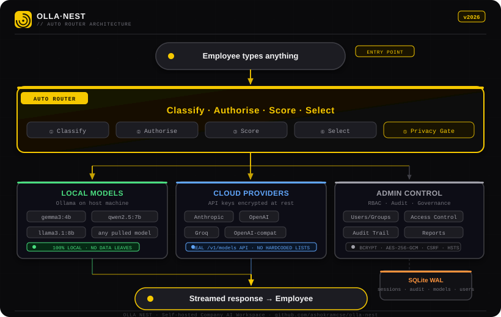

<div align="center">


### Your AI. Your rules. Your hardware.

**The company AI workspace that routes every request to the right model automatically —**  
**local Ollama models, cloud providers, or both. Zero lock-in. Full admin control.**

<br/>

[](https://github.com/ashokramcse/olla-nest/releases)
[](LICENSE)
[](https://hub.docker.com)
[](https://nodejs.org)
[](https://sqlite.org)

<br/>

[**Quick Start**](#quick-start) · [**Features**](#features) · [**Auto Router**](#auto-router) · [**Admin Dashboard**](#admin-dashboard) · [**Providers**](#cloud-provider-setup) · [**Security**](#security) · [**Docs**](docs/) · [**Changelog**](CHANGELOG.md)

<br/>

---

</div>

## What is Olla Nest?

Olla Nest is a **self-hosted company AI workspace** — an admin-controlled layer that sits on top of Ollama and any cloud provider. Employees open one URL, type anything, and the **Auto Router** picks the best available model automatically. No API keys for employees. No model names to memorise. No data leaving the building unless you explicitly configure it.

<div align="center">
  
</div>

---

## Features

<table>
<tr>
<td width="50%">

**🤖 Intelligence**
- Auto Router — classifies every request, picks the best model
- Chat memory — sliding-window session history, model remembers the conversation
- Sensitive content detection — SSN, PHI, API keys → local-only routing
- Manual model override in composer
- Project Knowledge — admin injects company context into every prompt

</td>
<td width="50%">

**🏢 Admin Control**
- Per-user, per-group, per-department model access
- RBAC role catalog with colour-coded permission groups
- Governance tier tagging (approved / restricted / private)
- Audit trail — every routing decision and admin action logged

</td>
</tr>
<tr>
<td>

**🔌 Multi-Provider**
- Ollama (local — any model you pull)
- Anthropic Claude (real `/v1/models` API — no hardcoded lists)
- OpenAI, Groq, any OpenAI-compatible endpoint
- Approved models instantly visible to router — no restart

</td>
<td>

**💬 Workspace**
- File upload — images (vision) + text files in composer
- Generated code saved to a configured project folder
- Integrated xterm.js terminal for `workspace:build` users
- Chat history — pin, archive, fork, rename threads
- Input history — ↑/↓ arrow keys navigate past messages

</td>
</tr>
<tr>
<td>

**📊 Reports & Analytics**
- 10 interactive Chart.js charts
- Token usage leaderboard (paginated)
- Latency by model, daily activity, dept usage
- Live vs failed breakdown

</td>
<td>

**🔒 Security**
- bcrypt passwords, AES-256-GCM API key encryption
- DOMPurify XSS sanitisation on all AI output
- Login rate limiting, CSRF protection, HSTS
- Workspace path traversal protection

</td>
</tr>
<tr>
<td>

**✨ Code Experience**
- Syntax highlighting — 30+ languages via highlight.js
- Language badges with per-language colour coding
- Line numbers on every code block
- Diff view — `+` green, `-` red, `@@` hunk headers
- Filename header — reads `// filename:` comment in code
- Full-screen code review modal (⛶ View button)

</td>
<td>

**🧠 Live Feedback**
- Thinking indicator — animated dots while model routes and generates
- Phase labels: Routing → Thinking → response streams in
- ↑/↓ input history like a terminal — draft preserved on ↓
- Copy button extracts clean plain text, not decorated HTML

</td>
</tr>
</table>

---

## Quick Start

> **Requirement:** [Docker](https://docs.docker.com/get-docker/) + Docker Compose v2.  
> [Ollama](https://ollama.com) on the host for local models — or an API key for cloud providers.

```bash
git clone https://github.com/ashokramcse/olla-nest.git
cd olla-nest
cp .env.example .env        # edit credentials before first boot
docker compose up --build
```

Open **[http://localhost:3000](http://localhost:3000)**

| | Admin | Employee |
|---|---|---|
| **URL** | `/admin-login` | `/login` |
| **Default email** | `admin@ollanest.local` | *(created by admin)* |
| **Default password** | `CHANGE_ME_ON_FIRST_BOOT` | *(shown on creation)* |

> ⚠️ **Change the admin password on first login.** Admin → Users → Edit, or set `DEFAULT_ADMIN_PASSWORD` in `.env` before boot.

---

## Ollama Setup

Ollama runs on the **host machine**. The container reaches it via `host.docker.internal`.

| Platform | Action needed |
|---|---|
| macOS / Windows (Docker Desktop) | Nothing — works out of the box |
| Linux | Already configured via `extra_hosts` in `docker-compose.yml` |
| Remote machine | Set `OLLAMA_URL=http://192.168.x.x:11434` in `.env` |

```bash
# Pull a few models to get started
ollama pull gemma3:4b          # fast, 4 GB, great default
ollama pull qwen2.5:7b         # strong all-rounder, 32k context
ollama pull llama3.1:8b        # reasoning, 128k context
ollama pull gemma4:26b         # vision + text, 128k context
```

---

## Cloud Provider Setup

1. Open **Admin → Providers → Add Provider**
2. Choose type (Anthropic / OpenAI / Groq / Custom), enter API key
3. Click **Sync Models** — calls the provider's real model list API
4. **Approve** any models you want employees to access
5. Done — approved models are immediately live in the Auto Router

No restart. No hardcoded model names. Works for any number of providers simultaneously.

---

## Configuration

```env
# .env — copy from .env.example

DEFAULT_ADMIN_EMAIL=admin@yourcompany.com
DEFAULT_ADMIN_PASSWORD=replace-with-a-strong-password
DEFAULT_USER_PASSWORD=replace-with-employee-default
OLLAMA_URL=http://host.docker.internal:11434
SECRET_KEY=replace-with-64-char-hex-string
SESSION_SECRET=replace-with-random-string
```

```bash
# Apply changes
docker compose down && docker compose up --build
```

---

## Code Experience

Every AI response that contains code is rendered with a professional code block:

| Feature | Detail |
|---|---|
| **Syntax highlighting** | 30+ languages — JS, TS, Python, Rust, Go, SQL, HTML, CSS, YAML, and more |
| **Language badge** | Colour-coded pill per language (JS=yellow, TS=blue, Python=green, SQL=orange…) |
| **Line numbers** | Every line numbered in a fixed-width gutter |
| **Diff view** | Lines starting with `+` → green, `-` → red, `@@` → blue hunk header. Auto-detected |
| **Filename header** | First-line comment `// filename: src/app.js` shows a file chip in the header bar |
| **⛶ View** | Opens the code block in a full-screen modal with clean highlighting and line count |
| **Copy** | Copies plain text — no markup, no line numbers in clipboard |
| **Run** | Shell code blocks get a ▶ Run button that sends the command to the embedded terminal |

---

## Project Knowledge

Admins can inject company-wide context into every chat prompt via **Admin → Settings → Project Knowledge**.

```
Example:
This is a Next.js 14 + Postgres platform. Always use TypeScript strict mode.
Prefer Tailwind CSS. Never use class components. All API routes live in /app/api/.
```

Every employee message — regardless of mode — will have this context prepended in the system prompt. Useful for:
- Tech stack conventions
- Coding standards and patterns
- Team-specific terminology
- Project structure notes

---

## Auto Router

The router runs on every message — invisible to the employee, fully auditable by admins.

| Step | What happens |
|---|---|
| **1. Classify** | Detects request type: coding, writing, reasoning, medical, OCR, general… |
| **2. Authorise** | Finds which models the user can access via user + group + department grants |
| **3. Score** | Ranks each candidate: capability match × speed × quality × privacy weight |
| **4. Select** | Picks the highest-scoring available model |
| **5. Privacy gate** | SSN / credit card / PHI detected → local-only, regardless of user settings |
| **6. Fallback** | No model available → clear error with admin configuration guidance |

The routing decision (model name, reason, candidate scores) is shown in the **Auto Router** panel on the right side of every chat.

---

## Chat Memory

Every session's history is stored in SQLite and sent back to the model on every turn.

```
Token budget = model context limit
             − system prompt tokens
             − new message tokens
             − 512 (response buffer)

Walk history newest → oldest:
  if message fits in budget → include it
  else → stop (older messages dropped)

Final array sent to model:
  [system prompt, ...kept history, new user message]
```

Context limits are fetched dynamically — from Ollama's `/api/show` for local models, from `api_models.context_window` for cloud providers. Nothing hardcoded.

---

## Admin Dashboard

| Tab | What you can do |
|---|---|
| **Overview** | Live stats, audit event feed, quick actions |
| **Chat** | Admin test chat with full router panel and streaming |
| **Models** | Sync Ollama models, set governance tier and scores |
| **Users** | Create / edit employees, inline permission grid, deactivate |
| **Access Control** | Department defaults, RBAC roles, permission matrix |
| **Settings** | Router config, workspace root, API model access |
| **Providers** | Add / sync / test Anthropic, OpenAI, Groq, custom |
| **Reports** | 10 Chart.js charts + paginated leaderboard |

---

## Security

| Control | Details |
|---|---|
| Sessions | `HttpOnly`, `SameSite=Lax`, `Secure` (HTTPS), 12-hour expiry |
| Login protection | 10 failed attempts per IP per 15 min → lockout |
| CSRF | `X-Requested-With` required on all state-changing requests |
| Passwords | bcrypt cost 12 |
| API keys | AES-256-GCM encryption at rest |
| AI output | DOMPurify sanitisation before rendering |
| Workspace | Path traversal protection, writes restricted to workspace root |
| Privacy routing | PHI / SSN / credit card patterns → forced local model |

---

## Docker Commands

```bash
docker compose up --build          # build and start
docker compose up -d --build       # background
docker compose down                # stop (data persists)
docker compose down -v             # stop + DELETE ALL DATA
docker compose logs -f app         # stream logs
docker compose restart app         # restart without rebuild
```

---

## Project Structure

```
olla-nest/
├── server.js              # Express backend — all routes, auth, router engine, SSE
├── package.json
├── Dockerfile             # Node 24 Alpine
├── docker-compose.yml
├── .env.example
│
├── public/
│   ├── app.html + app.js          # Employee workspace SPA
│   ├── admin.html + admin.js      # Admin dashboard SPA
│   ├── login.html + login.js      # Employee sign-in
│   ├── admin-login.html           # Admin sign-in
│   ├── theme.js                   # Design-system colour engine (CSS var tokens)
│   ├── styles.css                 # Design system (all components)
│   ├── logo.svg                   # Brand logo mark (inline, CSS var colours)
│   └── favicon.svg                # Favicon (hardcoded brand colours)
│
├── data/                          # Runtime only — gitignored
│   ├── olla-nest.sqlite
│   └── workspace/
│
└── docs/
    ├── ARCHITECTURE.md            # Architecture deep-dive
    ├── BRAND.md                   # Branding guidelines
    ├── architecture.svg           # Architecture diagram (branded)
    ├── logo-readme.svg            # Logo for README / external use
    ├── ENTERPRISE_ACCESS_CONTROL.md
    └── DEPLOYMENT.md
```

---

## Roadmap

- [ ] SSO / LDAP / SAML integration
- [ ] RAG document knowledge base
- [ ] Conversation summarisation for ultra-long sessions
- [ ] Department and group policy editor UI
- [ ] Usage analytics dashboard for employees
- [ ] Desktop app (Tauri) for macOS, Windows, Linux
- [ ] Mobile PWA
- [ ] Webhook / notification support for admin alerts

---

## Request a Feature

Olla Nest is **not an open-contribution project** — there are no pull requests.  
Every feature is designed and built by the maintainer team to keep the product coherent and secure.

**Have a feature idea?** Tell us what you need and we build it.

> 💡 [**Open a Feature Request →**](https://github.com/ashokramcse/olla-nest/issues/new?template=feature_request.md)
>
> Describe what you want, why you need it, and who it affects.  
> No code required. No mockups required. We read every request.

**Found a bug?**

> 🐛 [**Open a Bug Report →**](https://github.com/ashokramcse/olla-nest/issues/new?template=bug_report.md)

See [CONTRIBUTING.md](CONTRIBUTING.md) for the full process and what we will and won't build.

---

<div align="center">

[Architecture](docs/ARCHITECTURE.md) · [Enterprise Access Control](docs/ENTERPRISE_ACCESS_CONTROL.md) · [Deployment](docs/DEPLOYMENT.md) · [Changelog](CHANGELOG.md) · [Version History](VERSION.md)

<br/>

**Built for teams that want AI power without giving up control.**

</div>
